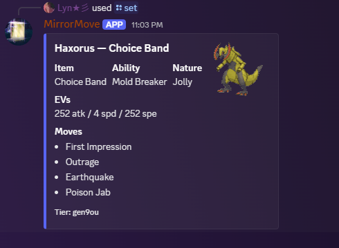

## Mirror Move Discord Bot


## Commmands 

- [Display]
- [Summary]
- [Stats]
-[Mono]
- [Battle]


```/stats```
Showcasing stats for Duraludon.


```/display```

Showing an OU team from PokePaste.


```/mono```

Createes a mono-type team.


```/matchup```

```/set```



Displays a well known or common set for a Pokemon. (ie: best item, best nature, best moves)


## Coming soon 

```/teambuilder```

- Will build a team based on a chosen tier 

```/battle```

- Allows Discord users to request the AI to battle them on showdown
